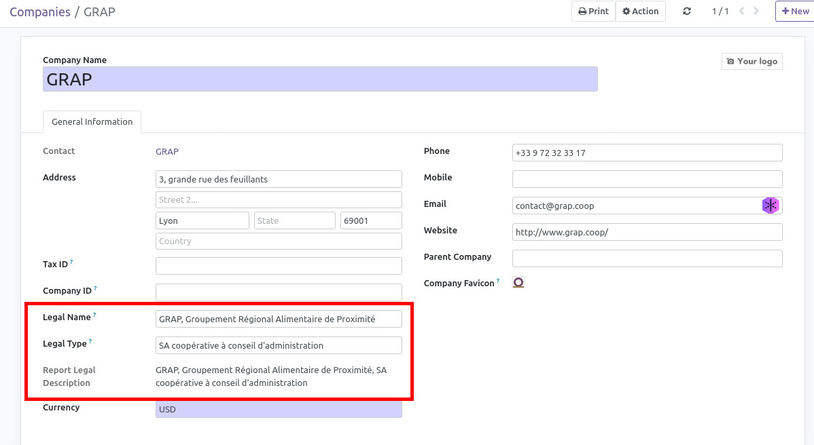
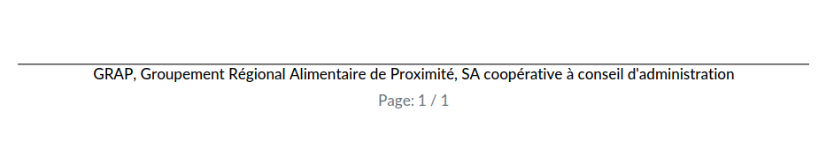

* go to the company form view and set the new information.

* The new informations are now available in the external Layout
  background used for official reports. (quotation, invoices, etc.)

If you create your custom report, you can call the new computed field
``report_legal_description``
