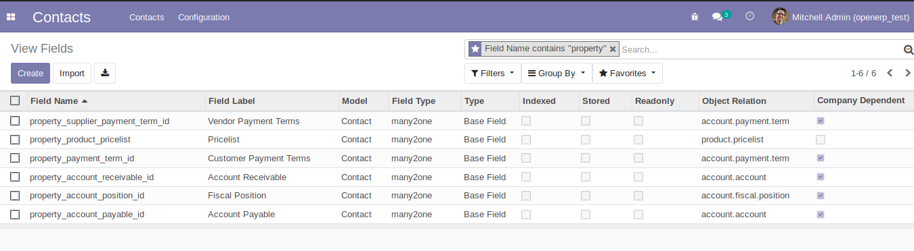
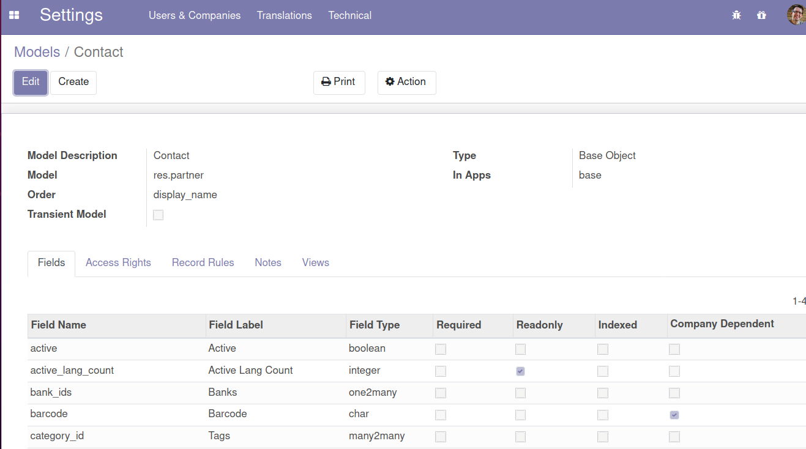

Display company_dependent state of fields in "ir.model.fields" views

company_dependent value of a field can be overrided in any module.
Then it can be difficult to guess this value in a odoo instance with a lot of modules.

This module is mainly intended for developers

