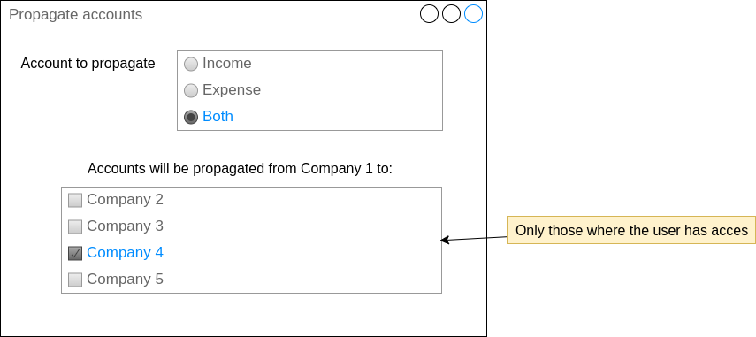

Since this module propagates product accounts based on the account code, it
should only be used in a database where all companies belong to the same country.

We could add a wizard that allows the user to select multiple products and propagate
their accounts to multiple companies, in mass. This would improve the usability and fix
the issue on multi-country installations. Example:

