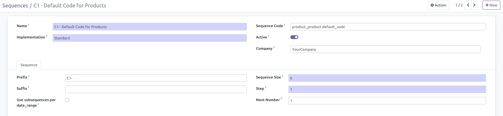
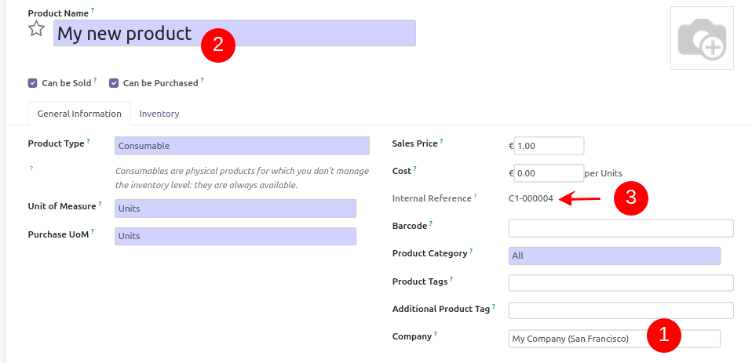

This module extends the functionality of product module to generate automatically internal reference
(``default_code``) for product.

Note, for that purpose, the field become readonly, and a sequence is created automatically per company.

The new products will a default code with the following pattern
``COD-XXXXXX``, where ``COD`` is the code of the company of the product,
and ``XXXXXX`` is a autoincremented value.

**Note**

This new feature is enabled only for products that belong to a company.
