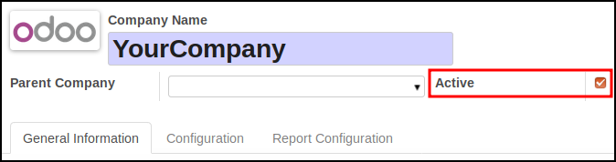

This module adds ``active`` fields on company model.

**Note**

A control is realized, to check if the disabled company is the current company
for active users.

.. figure:: ../static/description/validation_error.png
