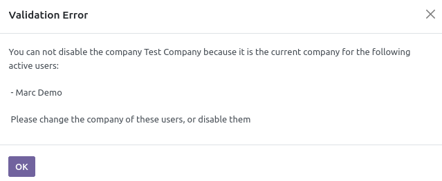

This module adds the possibility to archive companies by UI via the common "Action > Archive" button.

.. figure:: ../static/description/res_company_form.png

**Note**

A control is realized, to check if the disabled company is the current company
for active users.

