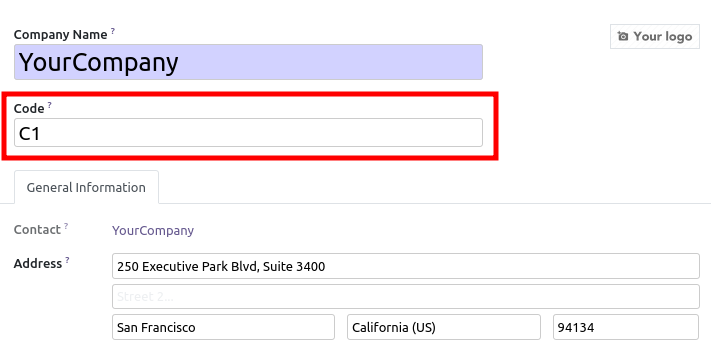
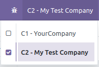
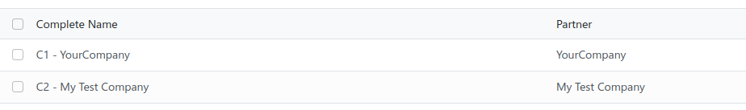

In a big multi-company context, users often use a code to indentify
the differents companies.

* This module adds ``code`` fields on company model.

This field is optional, but should be unique, if defined.

* This code will prefix the name, in the Odoo Switch Company Menu widget:

* this module also change the order of the companies, ordering by code, then
  by company name. (instead of by sequence, then by name). It so hides the now
  useless field sequence.

